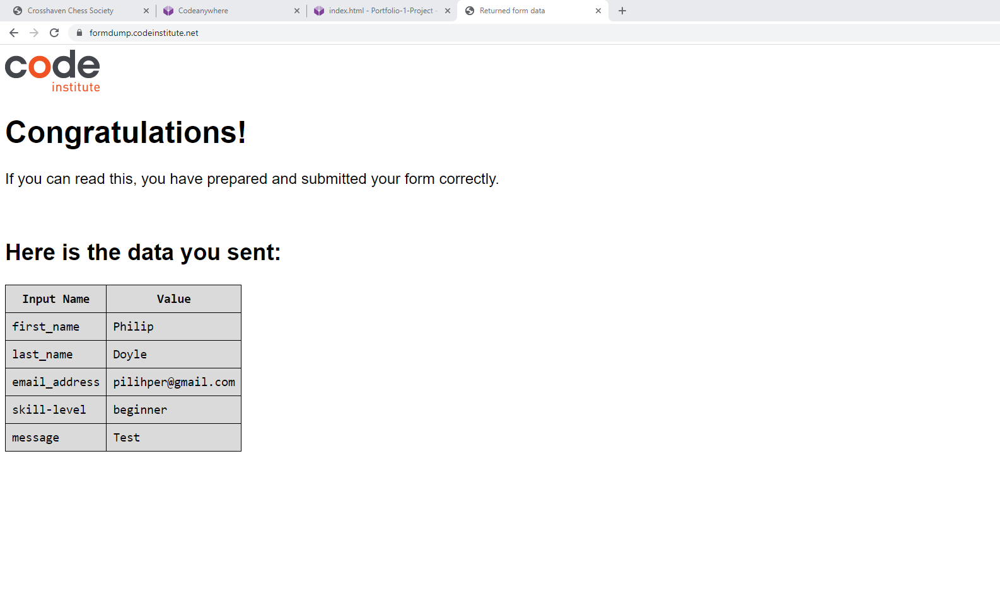

<h1 align="center">Crosshaven Chess Society</h1>

[View the live project here](https://pdoylec.github.io/Portfolio-1-Project/index.html)

Crosshaven Chess Society is a site that advertises a fictional chess clud. The club primarily use is for chess lovers to come a play games againest other players or to come and learn how to play. The site is targeted toward people in the Cork area who are close to Crosshaven. The site will be useful for people who want to learn the game and interact with other chess players.

### Existing Features

- __F01 Navigation Bar__

  - The navigation bar has a consistent look and placement on all four pages of the website supporting easy navigation.  It includes a simple Logo, Home page, Puzzle, Gallery and Contact links and is responsive on multiple screen sizes.

      

- __F02 Hero image__

- The landing area includes a photograph of chess piece's in black and white to capture the black and white piece's that are used in chess, black and white will be used as a colour through the site to represent this, Green is also used as this is a popular colour for online chess.
      

- __F03 Company Ideals section__

  - The Chess Society opening times and what lesson are on are displayed cards on the main page.  These cards give the user more information about when specific classes are on and with open play all level are welcome.

- __F04 Footer__

  - The footer is featured on all pages and is identical on each page making it easy to use.

    - Opening Times - having the opening times in the footer of the home page give easy access to see when classes are and when the area is available for games.

    - Stay in Touch - this area has links to social media sites associated with the organisation encouraging the user to keep connected.  The links will open in a new tab to allow easy navigation for the user. The organisation can use these sites to promote brand awareness and keep customers interested through updates, offers, chats and other marketing efforts. (As the Chess Society is a ficticious club, the links currently just go to the social media main websites.)

- __F07 Contact Page - 'Contact Us'__

  - The 'Contact Us' panel of the Contact page allows the user to send a message/give feedback to the company and if they want, sign up to the company mailing list to get discount codes and offers.  The user is asked to provide their name and email address when sending a message. By default, the option to join the mailing list is set to 'no' - to prevent them accidentally signing up for the mailing list and getting unwanted email. Sending the message will result in being directed to a page saying that someone will be in contact soon and you will be redirected back to the home page.

- The 'Contact Us' page was tested with the "formdump.codeinstitute.net" page with the data they submitted displayed.

    - The 'Contact Us' now sends the user to a page saying that someone will be in contact soon and you will be redirected back to the home page.
  

- __F08 Contact Page - 'How to Find Us'__

  - The 'How to Find Us' panel of the Contact page gives the user an interactive google map showing the location of the company along with details on full address, phone number and administration email address in large font to make it easily readable.  By clicking the 'View larger map' link the user can go to the google maps site for the address - this opens in a separate tab to allow ease of navigation.

      

- __How these features support the User Stories__

  - The User Stories in the [User Experience (UX)](#user-experience-ux) part of this document are numbered and categorised into groups A (first time visitor), B (returning visitor) and C (frequent visitor).  The existing features are listed above as F01 to F08.  Below is a traceability matrix cross-referencing the user stories with the features, illustrating which features support which stories :

    

### Features which could be implemented in the future

- __Company Timeline__
  - A 'Company Timeline' page could be added to provide more information on the evolution of the business for users who would like to know more about the origins of the company, its ethos and its involvement with the community.

- __Navigation bar improvements__
  - The functionality of the navigation bar could be extended to make it "sticky" so that it would be available to the user without scrolling.
  - A hamburger menu could be implemented to save space on smaller screens.

## Design

### Colour Scheme

[Colormind.io](http://colormind.io/) was used to generate the colorscheme for this website.
 

### Fonts

The fonts chosen for the website were Anton for headings and Commissioner for the main bodies of text on the website. Each of these were imported using [Google Fonts](https://fonts.google.com/). Sans-serif was chosen as the back-up font - in case these fonts don't load - because of it's clear readability. Font Arvo was used.

## Credits

### Content

- Content for the pages were inspired by fellow Code Institute students from Ulrike Riemenschneider [link to site](https://uriem.github.io/art-school/index.html) for her classes timetable lay out and Margarita B [link to site](https://uriem.github.io/art-school/index.html) for the Welcome and Chess Benifits sections. 

### Code

- Code on how to do the fade-in of the hero image came from information on this page : [CSS Image fade-in tutorial](https://blog.hubspot.com/website/css-fade-in)
- Code on how to do the flip-card effect on the Home page was based on example code on : [W3Schools Flip card tutorial](https://www.w3schools.com/howto/howto_css_flip_card.asp)
- Code on how to include google map with marker was based on code from this site :  [How to embed Google Map](https://www.maps.ie/create-google-map/)
- Code on how to implement flex boxes was based on instructions from [YouTube Flexbox Tutorial](https://www.youtube.com/watch?v=S0a7PEOi0do)

### Media

- The colours used were based on a citrus/pastel palette from this website : [Lily Bug Design - Colour Wall](https://www.lilybugdesign.co.nz/colour-wall)
- The icons in the header, footer and on the back of the flip-cards were taken from [Font Awesome](https://fontawesome.com/)
- The fonts used were imported from [Google Fonts](https://fonts.google.com/)

- The hero image is a photo by Pat Eisenberge and is called The Pawn's Gambit, and was downloaded from [Unsplash](https://unsplash.com) :

  - <a href="https://images.unsplash.com/photo-1546548970-71785318a17b?ixid=MnwxMjA3fDB8MHxwaG90by1wYWdlfHx8fGVufDB8fHx8&ixlib=rb-1.2.1&auto=format&fit=crop&w=334&q=80">Main (hero/landing) image and background image</a> photo by <a href="https://unsplash.com/@brunabranco?utm_source=unsplash&utm_medium=referral&utm_content=creditCopyText">Bruna Branco</a>

  - <a href="https://unsplash.com/photos/9aOswReDKPo?utm_source=unsplash&utm_medium=referral&utm_content=creditShareLink" target="_blank" rel="noopener">Avocado</a> photo by <a href="https://unsplash.com/@thoughtcatalog?utm_source=unsplash&utm_medium=referral&utm_content=creditCopyText" target="_blank" rel="noopener">Thought Catalog</a>

  - <a href="https://images.unsplash.com/photo-1595475207225-428b62bda831?ixid=MnwxMjA3fDB8MHxwaG90by1wYWdlfHx8fGVufDB8fHx8&ixlib=rb-1.2.1&auto=format&fit=crop&w=500&q=80" target="_blank" rel="noopener">Watermelon</a> photo by <a href="https://unsplash.com/@amyshamblen?utm_source=unsplash&utm_medium=referral&utm_content=creditCopyText" target="_blank" rel="noopener">Amy Shamblen</a>

  - <a href="https://images.unsplash.com/photo-1564769610726-59cead6a6f8f?ixid=MnwxMjA3fDB8MHxwaG90by1wYWdlfHx8fGVufDB8fHx8&ixlib=rb-1.2.1&auto=format&fit=crop&w=448&q=80" target="_blank" rel="noopener">Sliced oranges</a> photo by <a href="https://unsplash.com/@euniquedeeann?utm_source=unsplash&utm_medium=referral&utm_content=creditCopyText" target="_blank" rel="noopener">Eunique Deeann</a>

  - <a href="https://images.unsplash.com/photo-1559181567-c3190ca9959b?ixlib=rb-1.2.1&ixid=MnwxMjA3fDB8MHxwaG90by1wYWdlfHx8fGVufDB8fHx8&auto=format&fit=crop&w=400&q=80" target="_blank" rel="noopener">Cherries</a> photo by <a href="https://unsplash.com/@picoftasty?utm_source=unsplash&utm_medium=referral&utm_content=creditCopyText" target="_blank" rel="noopener">Mae Mu</a>

### Acknowledgments

- Thank you to my mentor Elaine Roche who went out of her way to help to with points and tips and gave me very good advice and feedback on how to plan and execute this project and who provided me with lots of pointers on resources to help select colours and images and well as resources to help with coding and testing.
