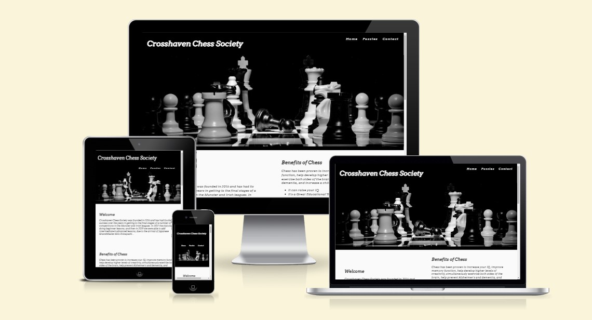
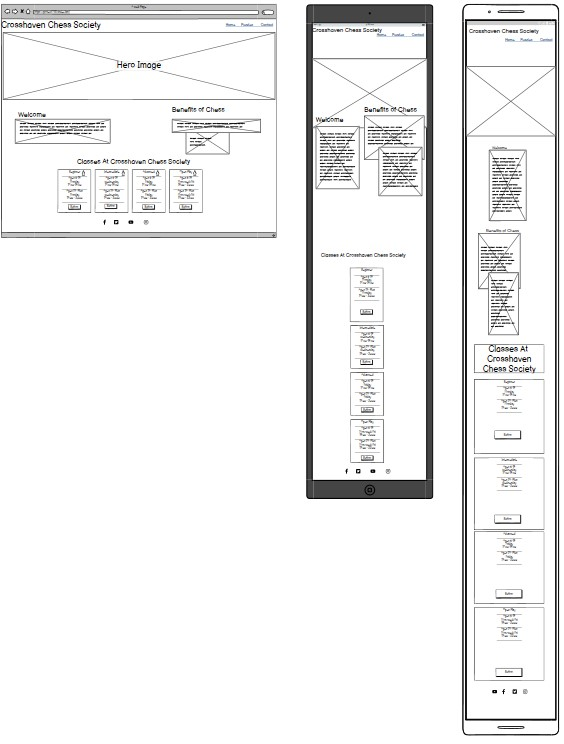
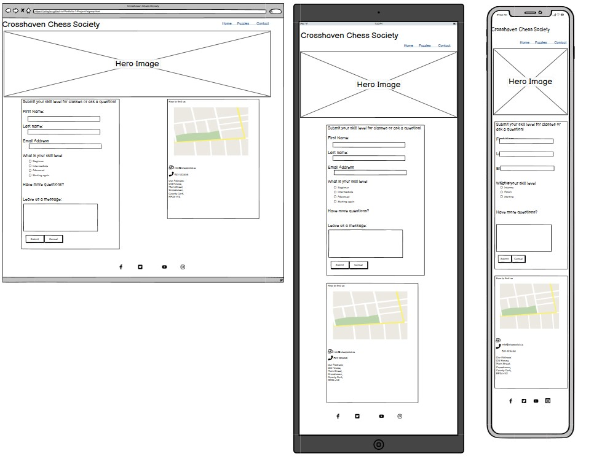
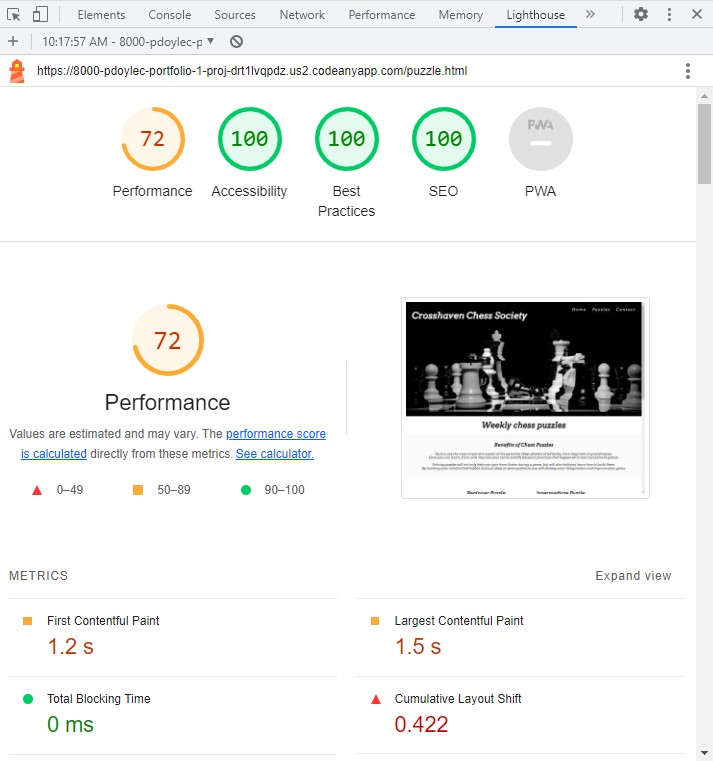
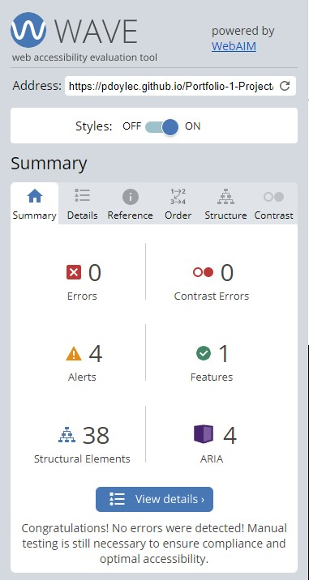

<h1 align="center">Crosshaven Chess Society</h1>

[View the live project here](https://pdoylec.github.io/Portfolio-1-Project/index.html)

Crosshaven Chess Society is a site that advertises a fictional chess club. The club primarily use is for chess lovers to come and play games against other players or to come and learn how to play. The site is targeted toward people in the Cork area who are close to Crosshaven. The site will be useful for people who want to learn the game and interact with other chess players.

## Contents
- [Contents](#contents)
- [Project Goals](#project-goals)
  - [...For the user](#for-the-user)
  - [...For the club owner](#for-the-club-owner)
- [Features](#features)
  - [Navigation Bar](#navigation-bar)
  - [Logo](#logo)
  - [Hero Image](#hero-image)
  - [Class Timetable](#class-timetable)
  - [Footer](#footer)
  - [Puzzle Page](#puzzle-page)
  - [Contact Page](#contact-page)
- [Design](#design)
  - [Colour Scheme](#colour-scheme)
  - [Fonts](#fonts)
- [Future changes](#future-changes)
- [Wireframes](#wireframes)
  - [Home Page](#home-page)
  - [Puzzle Page](#puzzle-page-1)
  - [Contact Page](#contact-page-1)
- [Testing](#testing)
  - [Code Validation](#code-validation)
  - [Lighthouse](#lighthouse)
  - [WAVE](#wave)
  - [Site Validation](#site-validation)
  - [Inspect](#inspect)
  - [404 ERROR](#404-error)
- [Bugs \& ERRORS](#bugs--errors)
- [Credits](#credits)
  - [Code/Content](#codecontent)
  - [Media](#media)
  - [Acknowledgments](#acknowledgments)

## Project Goals

### ...For the user

* To find out where the chess club is located.
* To easily navigate the site.
* To easily see when classes are and when open games are played.
* To have an enjoyable experience using their site.
* To have something to revisit the site for.
* An easy way to contact the club.

### ...For the club owner

* To show when classes and games are on.
* To get users to revisit the site for new puzzles.
* To be contactable for new members.

## Features

### Navigation Bar

  * The navigation bar has a consistent look and placement on all three pages of the website supporting easy navigation.  It includes a simple Logo, Home page, Puzzle, and Contact links and is responsive on multiple screen sizes.
- The navigation bar was designed to make it easy to read and with contrasting colours that are easy to read.
  * This section will allow the user to navigate from page to page without having to revert back to the previous page via the ‘back’ button.

      

### Logo
  
  * The Logo at the top left corner is clickable, and it redirects the user to the Home page once it is clicked.
  
### Hero Image

- The landing area includes a photograph of chess piece's in black and white to capture the black and white pieces that are used in chess, black and white will be used as a colour through the site to represent this, Green is also used as this is a popular colour for online chess.
      

### Class Timetable

  * The Chess Society opening times and what lessons are on, are displayed on cards on the main page.  These cards give the user more information about when specific classes are on and with open play all levels are welcome.

### Footer

  * The footer section includes links to the relevant social media sites for the Chess Club. The links will open to a new tab to allow easy navigation for the user.
  * The footer is valuable to the user as it encourages them to keep connected via social media.

    

### Puzzle Page
  * There is a benefits section to let the user know about how puzzle can improve your game.
  * The puzzle page is there for club members to test themselves on a weekly basis with new chess problems.
  * This page will attract users to come back to the site to check for new problems.
  * There is 4 problems, Beginner - Intermediate - Advanced - GrandMaster, for different user levels.
  * Advanced and GrandMaster puzzles images, don't have the square identifiers around the edge, as it'll challenge advanced users to learn the layout of a board.

      

### Contact Page

  * The Contact Us panel of the Contact page allows the user to send a message/give feedback to the club. The user is asked to provide their name and email address when sending a message. Sending the message will result in being directed to a page saying that someone will be in contact soon and you will be redirected back to the home page.

* The 'Contact Us' page was tested with the "formdump.codeinstitute.net" page with the data they submitted displayed.

* The 'Contact Us' now sends the user to a page saying that someone will be in contact soon and you will be redirected back to the home page.
  

* The How to Find Us panel of the Contact page gives the user an interactive google map showing the location of the company along with details on full address, phone number and administration email address in large font to make it easily readable.  By clicking the 'View larger map' link the user can go to the google maps site for the address - this opens in a separate tab to allow ease of navigation.

      

[Back to contents](#contents)

## Design

### Colour Scheme

[Colormind.io](http://colormind.io/) was used to generate the colorscheme for this website.
 

### Fonts

The fonts chosen for the website were Anton for headings and Commissioner for the main bodies of text on the website. Each of these were imported using [Google Fonts](https://fonts.google.com/). Sans-serif was chosen as the back-up font - in case these fonts don't load - because of it's clear readability. Font Arvo was used.

## Future changes
* Add images to the back of the flip cards, and have a photo of the solution instead of text. 
* Add animations for how chess pieces move on a board for beginners. 

[Back to contents](#contents)

## Wireframes
* The structure of the initial site will be three pages:
### Home Page
1. **Home Page** with navigation features in a header and class timetable.

### Puzzle Page

1. **Puzzle Page** with navigation features in a header, benefits of Chess Puzzles and Chess Puzzles.

### Contact Page
3. **Contact Page** with navigation features in a header, details for the user to contact the site owners about classes or any other questions and location of chess club with map.

[Back to contents](#contents)

## Testing

### Code Validation
* HTML
  - No errors, returned when passing through the official [W3C validator](https://validator.w3.org/nu/?doc=https%3A%2F%2Fcode-institute-org.github.io%2Flove-running-2.0%2Findex.html)
  - 
 
 
* CSS
  - No errors, found when passing through the official [(Jigsaw) validator](https://jigsaw.w3.org/css-validator/validator?uri=https%3A%2F%2Fvalidator.w3.org%2Fnu%2F%3Fdoc%3Dhttps%253A%252F%252Fcode-institute-org.github.io%252Flove-running-2.0%252Findex.html&profile=css3svg&usermedium=all&warning=1&vextwarning=&lang=en#css)
  - 
 

 ### Lighthouse
 * Lighthouse in chrome developer tool, was used to test the website for:
  - Performance - how the page performs whilst loading.
  - Accessibility - how accessible is the site for all users and how can it be improved.
  - Best practices - how does the site conform to industry best practices.
  - SEO - search engine optimization. Is the site optimized for search engine result rankings.

### WAVE

* I used WAVE (Web Accessibility Evaluation Tool) in chrome developer tools to test the website accessibility. WAVE is a tool that identifies ways to make a webpage more accessible to people with disabilities. WAVE scans the website for on-page and technical accessibility issues and errors to bring the site in line with recognized accessibility standards, like the Web Content Accessibility Guidelines (WCAG).

### Site Validation
* Each page of the site was tested, contact links, social media, flip cards, Nav bar on each page. checklist is below.

### Inspect

* I used Inspect to make changes to the code and to test layout and positioning. Inspect was used to test the different media screen sizes. When there was a difference in the size of a 320x480px screen and the border size, Inspect was used to test the size and remove the overhang by changing the width from 20.75rem to 12.75rem.

### 404 ERROR

- After <https://pdoylec.github.io/Portfolio-1-Project/index.html> was entered into the search bar and Crosshaven Chess Society site was opened, the following letters were entered to the end of the search <dfghjklghj>. The 404 ERROR page opened. 

## Bugs & ERRORS

* Hero image wasn't shrinking for smaller screen size, tried picture element, also tried using img for desktop and 1 for mobile and using CSS for style with min and max width of the screen size. Using Width Switching worked in the end, where the browser will load the small image at small viewport sizes, the medium image at medium viewport sizes, and the large at large viewport sizes, resources where found at the following site Tuts Plus [link to site](https://webdesign.tutsplus.com/tutorials/quick-tip-how-to-use-html5-picture-for-responsive-images--cms-21015#usingsizestocontrolimagelayout).
* When the code was ran through the HTML validator, there was when error for "When the `srcset` attribute has any image candidate string with a width descriptor, the `sizes` attribute must also be specified". This issue was resolved by adding `sizes="100vw"` to the HTML code. [Link to site](https://forum.getkirby.com/t/validating-html-error-with-srcset-missing-sizes-attribute/16494).

* Map was too large when website was opened on a phone. This was resolved in CSS in the Media screens section and changing the `width` and `height` for contact-panel-right.
* There was a bug in FireFox web browser with the flip cards, the issue was that the front of the card could be seen in reverse when looking at the back of the card. I tried adding `transform: rotateX(0deg)` in FireFox dev tool which resolved the issue in FireFox, but when this was added to Chrome dev tool the card wouldn't flip over. Next I added `backface-visiblity:hidden` to `level1-ideals-container` which resolved the issue in FireFox and didn't effect the cards flipping in Chrome. [Link to FireFox Bug fix](https://stackoverflow.com/questions/9604982/backface-visibility-not-working-properly-in-firefox-works-in-safari).

[Back to contents](#contents)

## Credits

### Code/Content

* Content for the pages were inspired by fellow Code Institute students from Ulrike Riemenschneider [Art school Link](https://uriem.github.io/art-school/index.html) for her classes timetable layout and Margarita B [Art school Link](https://uriem.github.io/art-school/index.html) for the Welcome and Chess Benefits sections.
* Contact page code was inspired by The Coders Coffeeshop page, Ulrike Riemenschneider and Elaine Roche (https://elainebroche-dev.github.io/ms1-thrive/contact.html)
* Code for 404 error page was inspired by Megan_5P [Northern lights Link](https://modonohoe.github.io/aurora-chasers-ireland/).
* Code for media screens response was inspired by [Media Queries Link](https://www.w3schools.com/css/css_rwd_mediaqueries.asp), Chris Williams (<https://chr15w1986.github.io/Portfolio-1/index.html>), Ulrike Riemenschneider, Margarita B and Elaine Roche.
* Code for Disclaimer was inspired by Elaine Roche [Thrive Link](<https://elainebroche-dev.github.io/ms1-thrive/contact.html>)
* Code on how to create the fade-in of the Crosshaven Chess Society and menu bar came from information on this page : [CSS Image fade-in tutorial](https://blog.hubspot.com/website/css-fade-in).
* Code on how to create the flip-card effect on the Puzzle page was inspired by Elaine Roche [Thrive Link](<https://elainebroche-dev.github.io/ms1-thrive/contact.html>) and based on example code on : [W3Schools Flip card tutorial](https://www.w3schools.com/howto/howto_css_flip_card.asp).
* Contact page code was inspired by The Coders Coffeeshop page,
* code on how to create a shadow around the submit button [How to create shadows](<https://www.w3schools.com/cssref/css3_pr_box-shadow.php>).
* Code on how to include google map with marker was based on code from this site :  [How to embed Google Map](https://www.maps.ie/create-google-map/).
* Code on how to implement flex boxes was based on instructions from [YouTube Flexbox Tutorial](https://www.youtube.com/watch?v=S0a7PEOi0do).
* Favicon code was found at the following site [Link to Favicon site](https://favicon.io/).

### Media

* The icons in the header, footer and on the back of the flip-cards were taken from [Font Awesome](https://fontawesome.com/)
* The fonts used were imported from [Google Fonts](https://fonts.google.com/)
* The hero image is a photo by Pat Eisenberge and is called The Pawn's Gambit, and was downloaded from [https://pixels.com/](https://pixels.com/featured/the-pawns-gambit-pat-eisenberger.html)
* The thank you page image is a photo by Felix Mittermeier, and was downloaded from [https://pixabay.com/](https://pixabay.com/photos/chess-board-game-board-game-2730034/)
* The chess puzzles are screen shot from [chess.com Link](https://www.chess.com/puzzles/rated) and are generated on the site. 

### Acknowledgments

* Thank you to my mentor Elaine Roche who went out of her way to help to with points and tips and gave me very good advice and feedback on how to plan and execute this project and who provided me with lots of pointers on resources to help select colours and images and well as resources to help with coding and testing.

[Back to contents](#contents)
