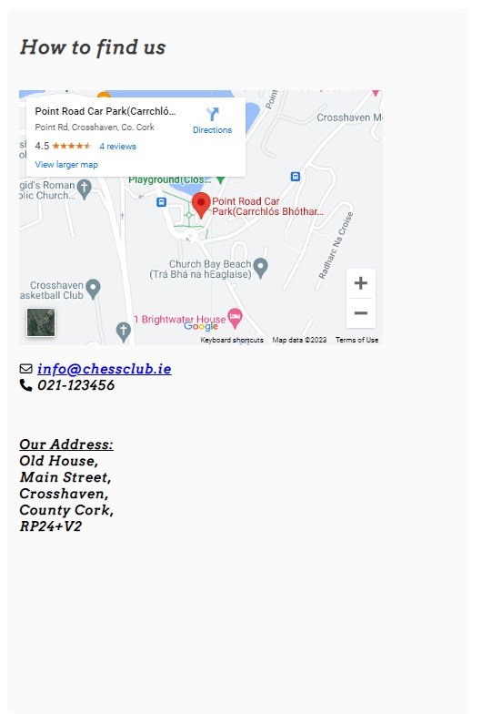

<h1 align="center">Crosshaven Chess Society</h1>

[View the live project here](https://pdoylec.github.io/Portfolio-1-Project/index.html)

Crosshaven Chess Society is a site that advertises a fictional chess clud. The club primarily use is for chess lovers to come a play games againest other players or to come and learn how to play. The site is targeted toward people in the Cork area who are close to Crosshaven. The site will be useful for people who want to learn the game and interact with other chess players.

* [Features](#features)
  * [Project Goals](#project-goals)
  * [Navigation Bar](#navigation-bar)
  * [Logo](#logo)
  * [Hero Image](#hero-image)

## Project Goals

### ...For the user

* To find out where the chess club is located.
* To easily navigate the site.
* To easily see when classes are and when open games are played.
* To have an enjoyable experience using their site.
* To have something to revisit the site for.
* An easy way to contact the club.

### ...For the club owner

* To show when classes and games are on.
* To get users to revisit the site for new puzzles.
* To be contactable for new members. 

### Features

- __Navigation Bar__

  * The navigation bar has a consistent look and placement on all three pages of the website supporting easy navigation.  It includes a simple Logo, Home page, Puzzle, and Contact links and is responsive on multiple screen sizes.
  * The navigation bar was designed to make it easy to read and with contrasting colors that are easy to read.
  * This section will allow the user to navigate from page to page without having to revert back to the previous page via the ‘back’ button.

      

- __Logo__

  * The Logo at the top left corner is clickable, and it redirects the user to the Home page once it is clicked.
  
- __Hero Image__

* The landing area includes a photograph of chess piece's in black and white to capture the black and white piece's that are used in chess, black and white will be used as a colour through the site to represent this, Green is also used as this is a popular colour for online chess.
      

- __Company Ideals section__

  * The Chess Society opening times and what lesson are on are displayed cards on the main page.  These cards give the user more information about when specific classes are on and with open play all level are welcome.

- __Footer__

  * The footer is featured on all pages and is identical on each page making it easy to use.

    * Opening Times - having the opening times in the footer of the home page give easy access to see when classes are and when the area is available for games.

    * Stay in Touch - this area has links to social media sites associated with the organisation encouraging the user to keep connected.  The links will open in a new tab to allow easy navigation for the user. The organisation can use these sites to promote brand awareness and keep customers interested through updates, offers, chats and other marketing efforts. (As the Chess Society is a ficticious club, the links currently just go to the social media main websites.)

- __Contact Page - 'Contact Us'__

  * The 'Contact Us' panel of the Contact page allows the user to send a message/give feedback to the company and if they want, sign up to the company mailing list to get discount codes and offers.  The user is asked to provide their name and email address when sending a message. By default, the option to join the mailing list is set to 'no' - to prevent them accidentally signing up for the mailing list and getting unwanted email. Sending the message will result in being directed to a page saying that someone will be in contact soon and you will be redirected back to the home page.

* The 'Contact Us' page was tested with the "formdump.codeinstitute.net" page with the data they submitted displayed.

* The 'Contact Us' now sends the user to a page saying that someone will be in contact soon and you will be redirected back to the home page.
  

- __Contact Page - 'How to Find Us'__

  * The 'How to Find Us' panel of the Contact page gives the user an interactive google map showing the location of the company along with details on full address, phone number and administration email address in large font to make it easily readable.  By clicking the 'View larger map' link the user can go to the google maps site for the address - this opens in a separate tab to allow ease of navigation.

      

### Features which could be implemented in the future

## Design

### Colour Scheme

[Colormind.io](http://colormind.io/) was used to generate the colorscheme for this website.
 

### Fonts

The fonts chosen for the website were Anton for headings and Commissioner for the main bodies of text on the website. Each of these were imported using [Google Fonts](https://fonts.google.com/). Sans-serif was chosen as the back-up font - in case these fonts don't load - because of it's clear readability. Font Arvo was used.

### Future changes

## Credits

### Content

* Content for the pages were inspired by fellow Code Institute students from Ulrike Riemenschneider [link to site](https://uriem.github.io/art-school/index.html) for her classes timetable layout and Margarita B [link to site](https://uriem.github.io/art-school/index.html) for the Welcome and Chess Benifits sections. 

### Code

* Code on how to create the fade-in of the Crosshaven Chess Society and menu bar came from information on this page : [CSS Image fade-in tutorial](https://blog.hubspot.com/website/css-fade-in)
* Code on how to create the flip-card effect on the Home page was based on example code on : [W3Schools Flip card tutorial](https://www.w3schools.com/howto/howto_css_flip_card.asp)
* code onhow to create a shadow around the submit button [How to create shadows](<https://www.w3schools.com/cssref/css3_pr_box-shadow.php>)
* Code on how to include google map with marker was based on code from this site :  [How to embed Google Map](https://www.maps.ie/create-google-map/)
* Code on how to implement flex boxes was based on instructions from [YouTube Flexbox Tutorial](https://www.youtube.com/watch?v=S0a7PEOi0do)

### Media

- The icons in the header, footer and on the back of the flip-cards were taken from [Font Awesome](https://fontawesome.com/)
- The fonts used were imported from [Google Fonts](https://fonts.google.com/)

- The hero image is a photo by Pat Eisenberge and is called The Pawn's Gambit, and was downloaded from [https://pixels.com/](https://pixels.com/featured/the-pawns-gambit-pat-eisenberger.html)
- The chess puzzles are screen shot from chess.com  [https://www.chess.com/home](https://www.chess.com/puzzles/rated) and are generated on the site. 

### Acknowledgments

- Thank you to my mentor Elaine Roche who went out of her way to help to with points and tips and gave me very good advice and feedback on how to plan and execute this project and who provided me with lots of pointers on resources to help select colours and images and well as resources to help with coding and testing.
